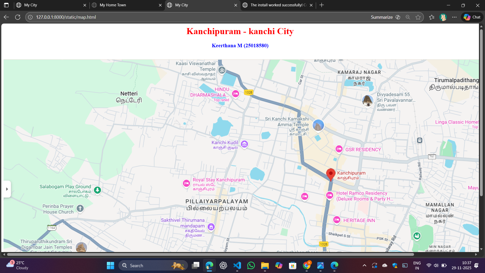
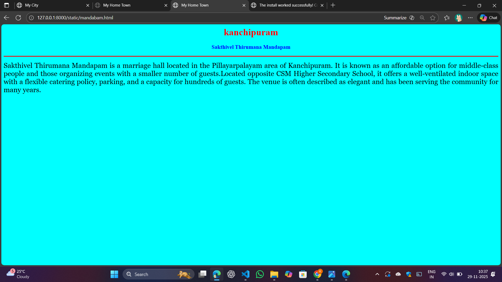
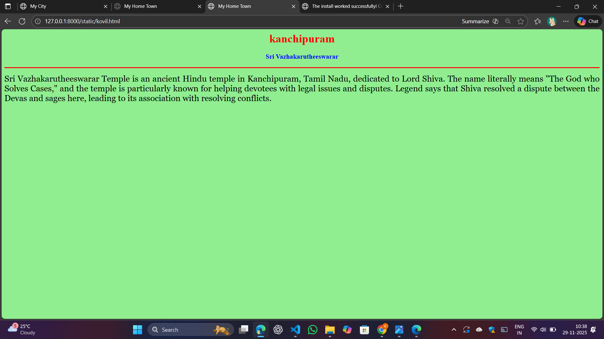
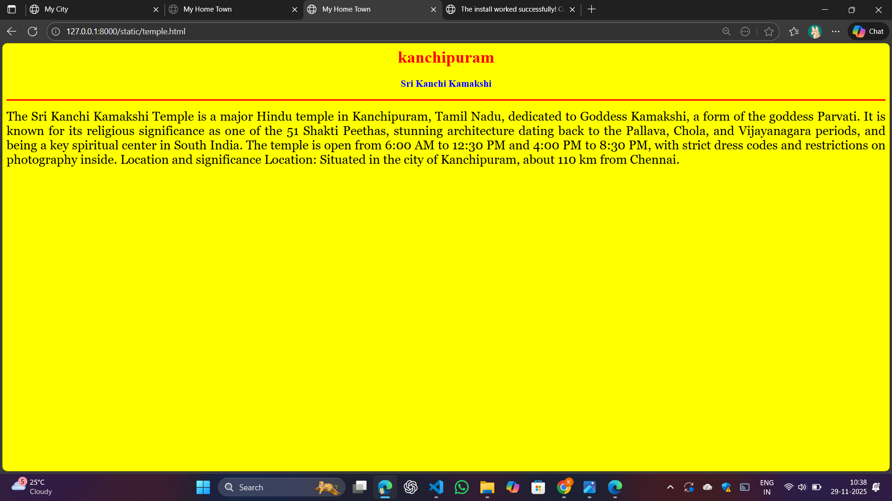
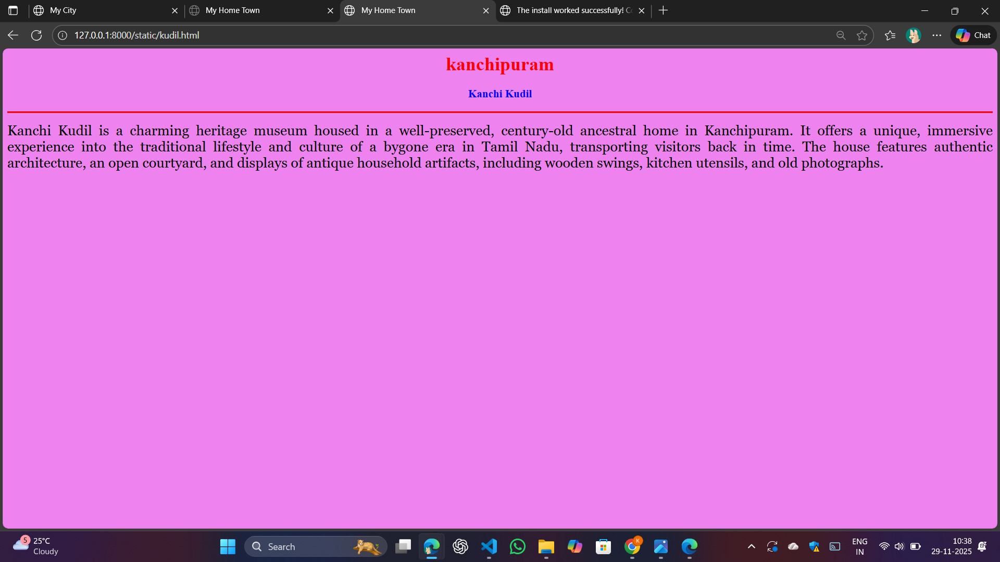
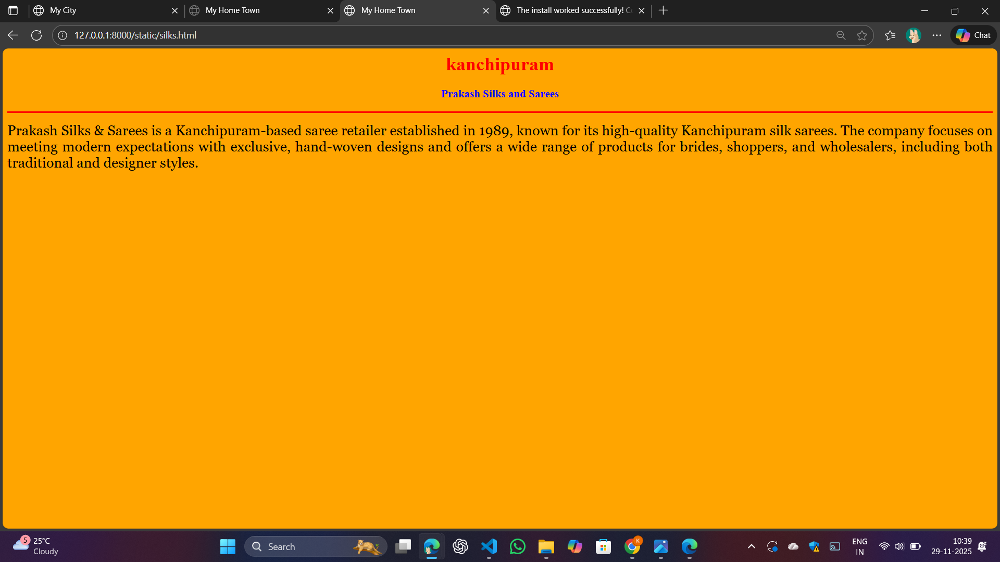

# Ex03 Places Around Me
## Date: 29.11.2025c

## AIM
To develop a website to display details about the places around my house.

## DESIGN STEPS

### STEP 1
Create a Django admin interface.

### STEP 2
Download your city map from Google as an image.

### STEP 3
Insert the image using `````` tag and link it to the map.

### STEP 4
Using ```<map>``` tag name the map.

### STEP 5
Create clickable regions in the image using ```<area>``` tag.

### STEP 6
Write HTML programs for all the regions identified.

### STEP 7
Execute the programs and publish them.

## CODE
```
map.html

<html>
    <head>
        <title>My City</title>
    </head>
    <body>
        <h1 align="center" >
            <font color="red">Kanchipuram - kanchi City</font>
        </h1>
        <h3 align="center">
            <font color="blue">Keerthana M (25018580)</font>
        </h3>
        <br>
        

<map name="image-map">
    <area target="" alt="Sri kanchi kamakshi" title="Sri kanchi kamakshi" href="temple.html" coords="905,173,1198,283" shape="rect">
    <area target="" alt="Sakthivel Thirumana Mandapam" title="Sakthivel Thirumana Mandapam" href="mandabam.html" coords="728,582,119" shape="circle">
    <area target="" alt="Sri Vazhakarutheeswarar" title="Sri Vazhakarutheeswarar" href="kovil.html" coords="1078,626,1159,597,1252,639,1210,739,1117,753" shape="poly">
    <area target="" alt="Prakash Silks and Sarees" title="Prakash Silks and Sarees" href="silks.html" coords="1255,704,1502,792" shape="rect">
    <area target="" alt="Kanchi Kudil " title="Kanchi Kudil " href="kudil.html" coords="836,295,67" shape="circle">
</map>
    </body>
</html>

temple.html

<html>
    <head>
        <title>My Home Town</title>

    </head>
    <body bgcolor="yellow">
        <h1 align="center">
            <font color="red">kanchipuram</font>
        </h1>
        <h3 align="center">
            <font color="blue">Sri Kanchi Kamakshi</font>
        </h3>
        <hr size="3" color="red">
        <p align="justify">
            <font face="Georgia" size="5">
                The Sri Kanchi Kamakshi Temple is a major Hindu temple in Kanchipuram, Tamil Nadu, dedicated to Goddess Kamakshi, a form of the goddess Parvati. It is known for its religious significance as one of the 51 Shakti Peethas, stunning architecture dating back to the Pallava, Chola, and Vijayanagara periods, and being a key spiritual center in South India. The temple is open from 6:00 AM to 12:30 PM and 4:00 PM to 8:30 PM, with strict dress codes and restrictions on photography inside. 
Location and significance
Location: Situated in the city of Kanchipuram, about 110 km from Chennai.

        </p>

    </body>
</html>

silks.html

<html>
    <head>
        <title>My Home Town</title>

    </head>
    <body bgcolor="orange">
        <h1 align="center">
            <font color="red">kanchipuram</font>
        </h1>
        <h3 align="center">
            <font color="blue">Prakash Silks and Sarees</font>
        </h3>
        <hr size="3" color="red">
        <p align="justify">
            <font face="Georgia" size="5">
                Prakash Silks & Sarees is a Kanchipuram-based saree retailer established in 1989, known for its high-quality Kanchipuram silk sarees. The company focuses on meeting modern expectations with exclusive, hand-woven designs and offers a wide range of products for brides, shoppers, and wholesalers, including both traditional and designer styles. 
        </p>

    </body>
</html>

kovil.html

<html>
    <head>
        <title>My Home Town</title>

    </head>
    <body bgcolor="lightgreen">
        <h1 align="center">
            <font color="red">kanchipuram</font>
        </h1>
        <h3 align="center">
            <font color="blue">Sri Vazhakarutheeswarar</font>
        </h3>
        <hr size="3" color="red">
        <p align="justify">
            <font face="Georgia" size="5">
                Sri Vazhakarutheeswarar Temple is an ancient Hindu temple in Kanchipuram, Tamil Nadu, dedicated to Lord Shiva. The name literally means "The God who Solves Cases," and the temple is particularly known for helping devotees with legal issues and disputes. Legend says that Shiva resolved a dispute between the Devas and sages here, leading to its association with resolving conflicts.
        </p>

    </body>
</html>

kudil.html

<html>
    <head>
        <title>My Home Town</title>

    </head>
    <body bgcolor="violet">
        <h1 align="center">
            <font color="red">kanchipuram</font>
        </h1>
        <h3 align="center">
            <font color="blue">Kanchi Kudil</font>
        </h3>
        <hr size="3" color="red">
        <p align="justify">
            <font face="Georgia" size="5">
                Kanchi Kudil is a charming heritage museum housed in a well-preserved, century-old ancestral home in Kanchipuram. It offers a unique, immersive experience into the traditional lifestyle and culture of a bygone era in Tamil Nadu, transporting visitors back in time. The house features authentic architecture, an open courtyard, and displays of antique household artifacts, including wooden swings, kitchen utensils, and old photographs. 
        </p>

    </body>
</html>

mandabam.html

<html>
    <head>
        <title>My Home Town</title>

    </head>
    <body bgcolor="aqua">
        <h1 align="center">
            <font color="red">kanchipuram</font>
        </h1>
        <h3 align="center">
            <font color="blue">Sakthivel Thirumana Mandapam</font>
        </h3>
        <hr size="3" color="red">
        <p align="justify">
            <font face="Georgia" size="5">
                Sakthivel Thirumana Mandapam is a marriage hall located in the Pillayarpalayam area of Kanchipuram. It is known as an affordable option for middle-class people and those organizing events with a smaller number of guests.Located opposite CSM Higher Secondary School, it offers a well-ventilated indoor space with a flexible catering policy, parking, and a capacity for hundreds of guests. The venue is often described as elegant and has been serving the community for many years. 
        </p>

    </body>
</html>


```


## OUTPUT













## RESULT
The program for implementing image maps using HTML is executed successfully.
